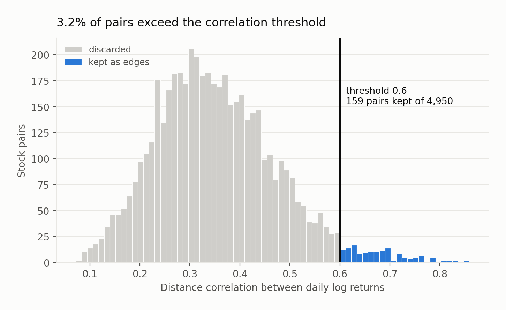
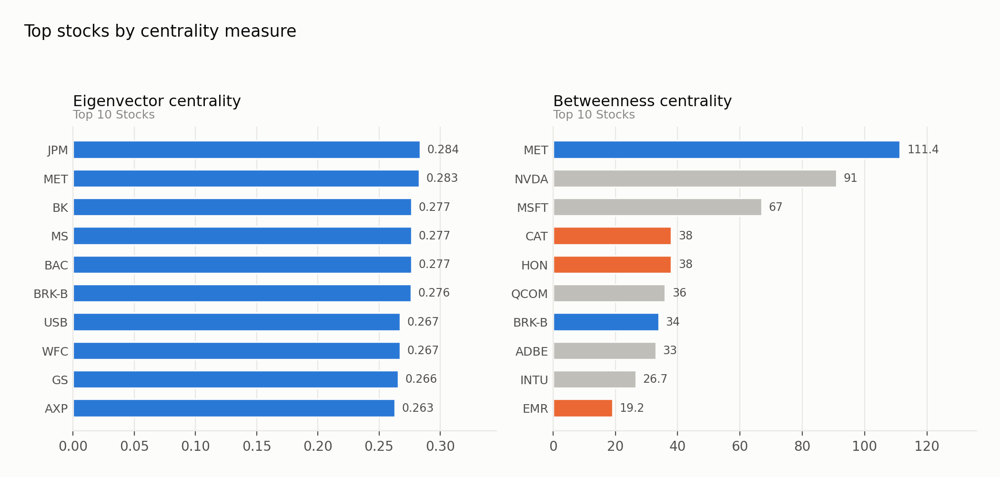
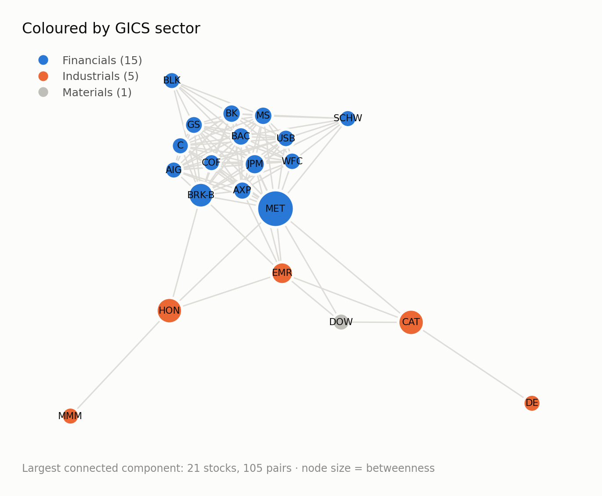
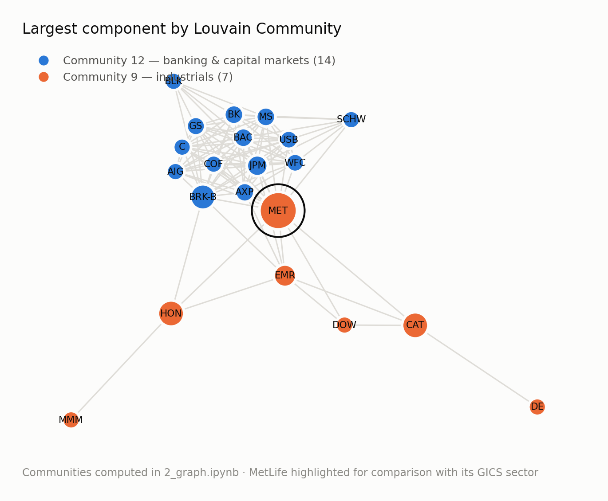
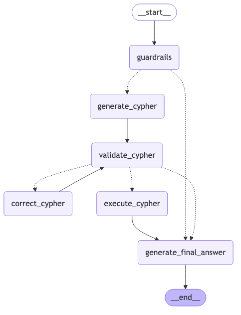

# Graph-Based Analytics for Stock Market Dynamics

This project explores relationships between S&P 100 stocks using graph analytics. I use distance correlation to capture non-linear relationships between stock returns, build the resulting network in Neo4j, and use LangGraph to query the graph in natural language.

| | |
|---|---|
| **Input** | 5 years of daily prices for 100 S&P 100 stocks from Yahoo Finance, transformed into standardised daily log returns |
| **Edge rule** | Distance correlation > 0.6 |
| **Graph** | 100 `Stock` nodes, 318 `correlated` relationships, `Sector` nodes, and an MST projection |
| **Analysis** | Degree, betweenness and eigenvector centrality, Weakly Connected Components, and Louvain community detection |
| **Query layer** | LangGraph workflow for domain checking, Cypher generation, validation and correction, query execution, and answer generation |


---

## 1. Building the graph

Distance correlation was calculated for all 4,950 possible stock pairs, using 0.6 as the threshold for creating an edge. This resulted in 159 unique stock pairs above the threshold, represented as 318 directed relationships in Neo4j.



With this threshold, 34 stocks have no connections. The graph contains 48 weakly connected components, with the largest containing 21 stocks. The following analysis focuses mainly on this component.

---

## 2. Comparing centrality measures



Eigenvector and betweenness centrality give quite different rankings. Eigenvector centrality mainly highlights financial institutions, which are strongly connected within the largest component. Betweenness centrality identifies stocks that connect different parts of the network, including MetLife, Nvidia, Microsoft, Caterpillar, Honeywell and Qualcomm.

MetLife is particularly interesting because it ranks highly under both measures. This led me to look more closely at its position in the graph.

---

## 3. Sector labels and Louvain communities

The largest connected component contains 21 stocks and 105 pairs. Using the original GICS sector labels, most of the component consists of financial and industrial stocks:



The Louvain communities were then compared with the original GICS sector labels:



The two Louvain communities are similar to the sector split, but there is one notable difference. MetLife is grouped with Caterpillar, Deere, Dow, Emerson, Honeywell and 3M rather than with the other financial stocks.

This is interesting because MetLife also has the highest degree in the graph (17) and the highest betweenness centrality (111.4, compared with 91.0 for the next stock). In this network, it therefore acts as an important connection between the two groups.

The Louvain partition has a modularity of 0.128. This is relatively low, so I would not interpret the two communities as strongly separated groups. Instead, I use the result as another way of looking at the structure already visible in the network and centrality measures.

---
## 4. Querying the graph with natural language



The final part of the project adds a natural-language interface to the Neo4j graph. LangGraph is used to separate the workflow into domain checking, Cypher generation, validation and correction, query execution, and final answer generation.

Below are two examples from `3_LLMintegration.ipynb`.

### Example 1: Sector query

**Question**

> How many stocks belong to the Information Technology sector?

**Generated Cypher**

```cypher
MATCH (s:Stock)-[:BELONGS_TO]->(:Sector {name:'Information Technology'})
RETURN count(DISTINCT s)      
```

There are 18 stocks that belong to the Information Technology sector.

---

## Design decisions

**Distance correlation instead of Pearson correlation.**  
The graph is based on distance correlation because relationships between stock returns are not necessarily linear. Distance correlation was calculated across all stock pairs, using 0.6 as the threshold for creating an edge. The methodology was based on Ugwu, Miasnikof & Lawryshyn, *Distance Correlation Market Graph: The Case of S&P500 Stocks*, Mathematics 2023, 11, 3832.

**WCC before Louvain.**  
At a threshold of 0.6, the graph contains 48 weakly connected components, including several small components and isolated stocks. WCC was used to identify these components before applying Louvain to the largest one (21 stocks). This allows the Louvain analysis to focus on community structure within the main connected group rather than on parts of the graph that are already disconnected.

**LangGraph for the query workflow.**  
`GraphCypherQAChain` was first used as a baseline for the natural-language query layer. While it provides a direct path from a question to Cypher execution, it offers limited control over the intermediate steps.

The LangGraph implementation makes these steps explicit. Questions pass through domain checking, Cypher generation and validation before execution. If validation identifies a problem, the query is sent through a correction step and validated again. Neo4j `EXPLAIN` and `CypherQueryCorrector` are also used during validation.

Both implementations are kept in the notebook, with `GraphCypherQAChain` serving as the baseline before the LangGraph workflow.

**Few-shot examples.**  
Question/Cypher pairs were added to match the graph schema and the types of stock-market questions used in this project. The examples are stored with FAISS and selected by semantic similarity, so each question receives the two most relevant examples rather than the same fixed examples every time.

---

## Attribution

The natural-language query workflow uses patterns from the [LangChain graph tutorial](https://python.langchain.com/docs/tutorials/graph/) as a reference.

The stock-market graph, distance-correlation analysis, Neo4j schema, centrality and community analysis, financial-domain guardrail, stock-market few-shot examples, and FAISS-based example selection were developed for this project.

---

## Repository

```
notebook/1_data.ipynb            Data collection, EDA, distance-correlation matrix, MST
notebook/2_graph.ipynb           Neo4j graph construction, centrality, WCC, Louvain
notebook/3_LLMintegration.ipynb  GraphCypherQAChain baseline, then the LangGraph workflow
image/figures.py            Compiled figures and images for the documentation
data/stocks.csv                  S&P 100 constituents with sector
data/correlation.csv             Pairwise distance correlations (all pairs)
data/mst_edges.csv               Minimum spanning tree edges
Project_StockMarketGraphDB.pdf   Full technical report
```

All notebooks are committed **with their outputs**, so every result above can be read without running anything.

---

## Running it

Requires a Neo4j instance with the Graph Data Science plugin, and an OpenAI API key.

```bash
git clone https://github.com/FernandaCladera/StockMarketGraph.git
cd StockMarketGraph
python -m venv venv && source venv/bin/activate
pip install -r requirements.txt
cp .env.example .env  
```

Run the notebooks: `1_data` → `2_graph` → `3_LLMintegration`.


---

Built as the final project for the Knowledge Graphs course, University of Lausanne.
